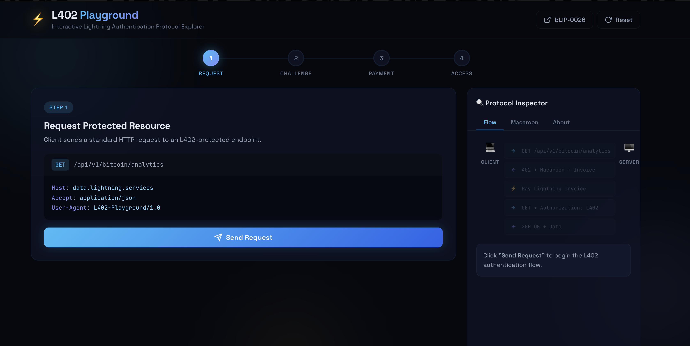
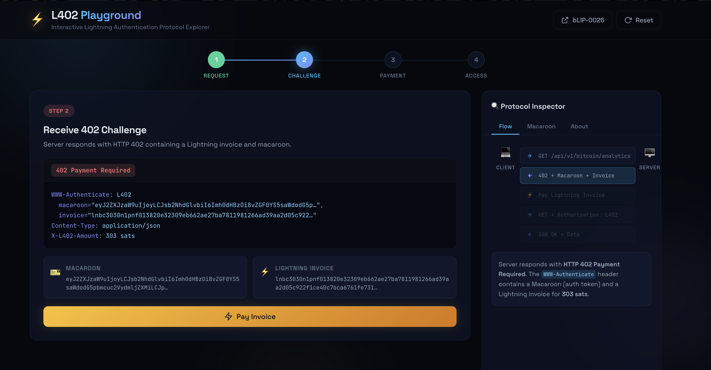
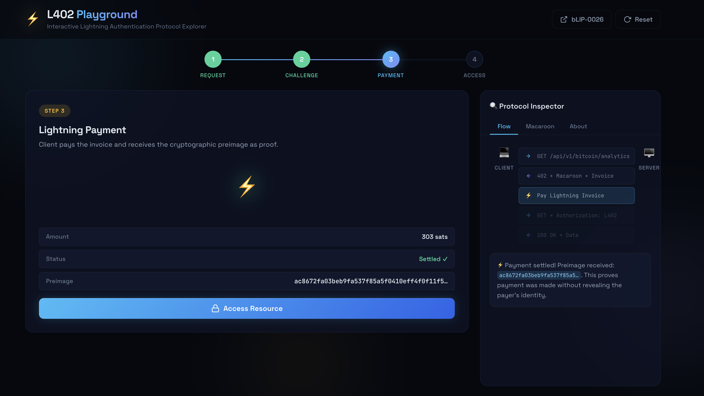
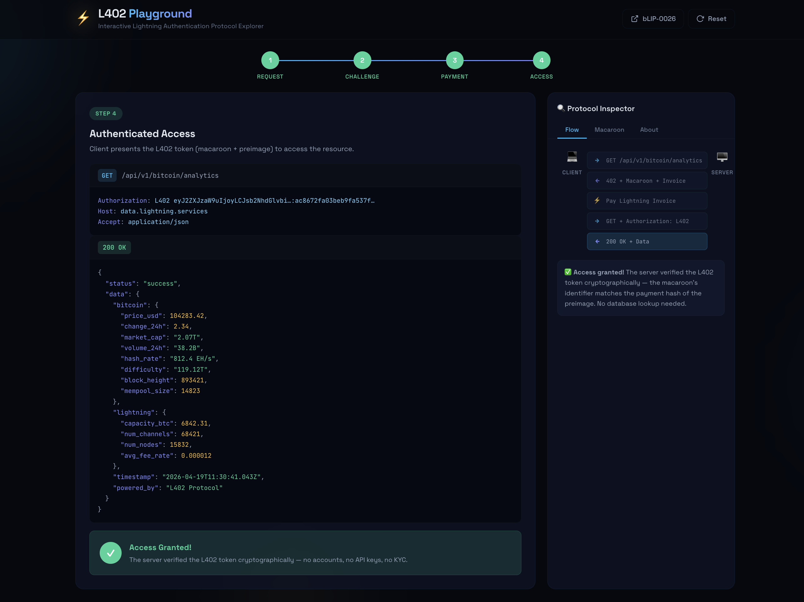
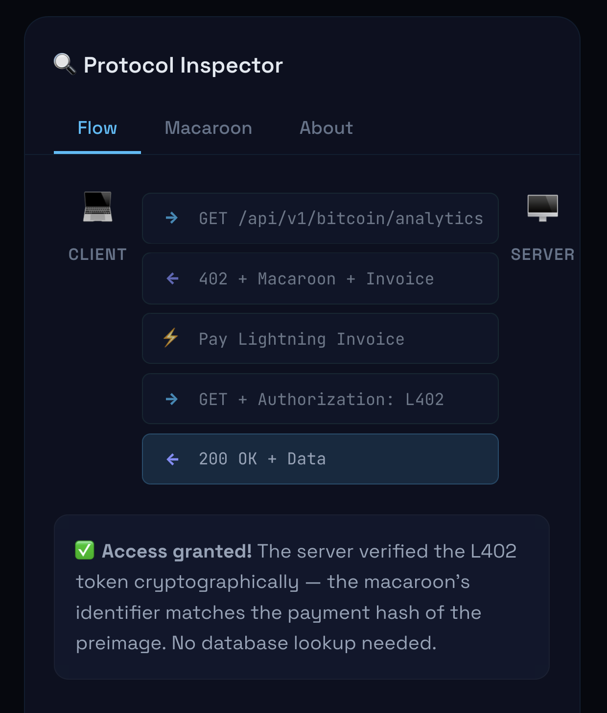

# ⚡ L402 Playground

**[🔴 Live Demo](https://wthrajat.github.io/l402-playground/)**

An interactive, browser-based explorer for the [L402 Lightning Authentication Protocol](https://l402.org/). Walk through the full protocol flow — from initial request to authenticated access — without needing a Lightning node, API keys, or any external services.

Everything runs in your browser using simulated macaroons, invoices, and preimages generated via the Web Crypto API.



> [!IMPORTANT]
> **This is a simulation / educational demo.** No real Lightning Network payments are made. All macaroons, BOLT11 invoices, and preimages are generated locally in your browser using the Web Crypto API. The cryptographic relationship between preimage and payment hash is real (SHA-256), but no sats move and no Lightning node is involved.

---

## What is L402?

L402 (formalized as **bLIP-0026**) (see [bLIP-0026](https://github.com/Roasbeef/blips/blob/L402/blip-0026.md)) is an internet-native authentication protocol that combines:

- **HTTP 402 Payment Required** — the long-dormant status code finally put to use
- **Lightning Network** — for instant, low-fee micropayments
- **Macaroons** — cryptographic bearer tokens with attenuable caveats

The result: any client (human or AI agent) can access paid APIs without accounts, passwords, or KYC. Just pay and prove it.

### The Protocol in 4 Steps

```
Client                                          Server
  │                                                │
  │──── GET /api/resource ────────────────────────▶│
  │                                                │
  │◀─── 402 + Macaroon + Lightning Invoice ────────│
  │                                                │
  │──── Pay Invoice (Lightning Network) ──────────▶│
  │◀─── Preimage (proof of payment) ───────────────│
  │                                                │
  │──── GET /api/resource ────────────────────────▶│
  │     Authorization: L402 <macaroon>:<preimage>  │
  │                                                │
  │◀─── 200 OK + Data ─────────────────────────────│
  │                                                │
```
---

## Getting Started

### Prerequisites

- [Node.js](https://nodejs.org/) (v18+)
- [pnpm](https://pnpm.io/) (or npm)

### Install & Run

```bash
git clone https://github.com/wthrajat/l402-playground.git && cd l402-playground
pnpm install
pnpm run dev
```

The app will open at [http://localhost:5173](http://localhost:5173).

---

## Walkthrough

### Step 1: Request a Protected Resource

The client sends a standard HTTP GET request to an L402-protected API endpoint.

```http
GET /api/v1/bitcoin/analytics HTTP/1.1
Host: data.lightning.services
Accept: application/json
User-Agent: L402-Playground/1.0
```

No credentials and no API key, just a plain request.

Click **"Send Request"** to fire the request.


---

### Step 2: Receive the 402 Challenge

The server doesn't return data. Instead, it responds with **HTTP 402 Payment Required** and a `WWW-Authenticate` header containing two things:

1. **Macaroon** — a base64-encoded bearer token tied to a payment hash
2. **Lightning Invoice** — a BOLT11 invoice for a small amount (e.g., 100-500 sats)

```http
HTTP/1.1 402 Payment Required
WWW-Authenticate: L402
  macaroon="AgELbGlnaHRuaW5nLnN...",
  invoice="lnbc1500n1pn3f8a2d7e..."
Content-Type: application/json
X-L402-Amount: 150 sats
```

The inspector panel on the right shows the decoded macaroon structure — click the **Macaroon** tab to explore its fields:

| Field | Description |
|-------|-------------|
| **Version** | Macaroon format version |
| **Location** | The service issuing the token |
| **Identifier** | The payment hash (SHA-256 of the preimage) |
| **Caveats** | Restrictions — service name, tier, permissions, expiry |
| **Signature** | Cryptographic signature binding everything together |



---

### Step 3: Pay the Lightning Invoice

The client pays the Lightning invoice. On the real Lightning Network this takes ~1 second. Upon settlement, the client receives the **preimage** — a 32-byte secret whose SHA-256 hash matches the invoice's payment hash.

This preimage is the cryptographic proof of payment.

```
Amount:     150 sats
Status:     Settled ✓
Preimage:   a1b2c3d4e5f6...  (64 hex chars)
```

Click **"Pay Invoice"** to simulate the Lightning payment. You'll see:
- A pulsing Lightning bolt animation during "payment"
- The preimage revealed once settled
- The status flipping to green



---

### Step 4: Authenticated Access

The client re-sends the original request, this time with an `Authorization` header containing the **L402 token** — the macaroon and preimage joined by a colon:

```http
GET /api/v1/bitcoin/analytics HTTP/1.1
Authorization: L402 AgELbGlnaHRuaW5nLnN...:a1b2c3d4e5f6...
Host: data.lightning.services
Accept: application/json
```

The server extracts the macaroon and preimage, then verifies:

1. ✅ SHA-256(preimage) matches the macaroon's identifier (payment hash)
2. ✅ The macaroon's signature is valid
3. ✅ All caveats are satisfied (not expired, correct service, etc.)

If everything checks out → **200 OK** with the requested data:

```json
{
  "status": "success",
  "data": {
    "bitcoin": {
      "price_usd": 104283.42,
      "market_cap": "2.07T",
      "hash_rate": "812.4 EH/s",
      "block_height": 893421
    },
    "lightning": {
      "capacity_btc": 6842.31,
      "num_channels": 68421,
      "num_nodes": 15832
    }
  }
}
```
Click **"Access Resource"** to complete the flow.



---

## Protocol Inspector

The right sidebar provides a real-time view of the protocol flow as a sequence diagram. Each message lights up as the corresponding step is executed:

| Message | Direction | Description |
|---------|-----------|-------------|
| `GET /api/v1/bitcoin/analytics` | Client → Server | Initial unauthenticated request |
| `402 + Macaroon + Invoice` | Server → Client | Payment challenge |
| `Pay Lightning Invoice` | Client → Network | Lightning payment (simulated) |
| `GET + Authorization: L402` | Client → Server | Authenticated request |
| `200 OK + Data` | Server → Client | Successful response |



---

## How the Simulation Works

This playground doesn't connect to any real Lightning node. Instead, it generates everything in-browser:

1. **Preimage**: 32 random bytes via `crypto.getRandomValues()`
2. **Payment Hash**: SHA-256 of the preimage via `crypto.subtle.digest()`
3. **Macaroon**: JSON object with the payment hash as identifier, base64-encoded
4. **Invoice**: Realistic-looking BOLT11 string (prefix + amount + random hex data)
5. **L402 Token**: `base64(macaroon):hex(preimage)`

The cryptographic relationship between preimage and payment hash is **real** — the SHA-256 hash actually matches. Only the Lightning payment settlement is simulated.

---

## Resources

- [bLIP-0026 — L402 Protocol Specification](https://github.com/lightning/blips/blob/master/blip-0026.md)
- [l402.org](https://l402.org) — Protocol overview
- [Aperture](https://github.com/lightninglabs/aperture) — L402 reverse proxy by Lightning Labs
- [Lightning Labs: L402 Overview](https://docs.lightning.engineering/the-lightning-network/l402)

---

## License

MIT
